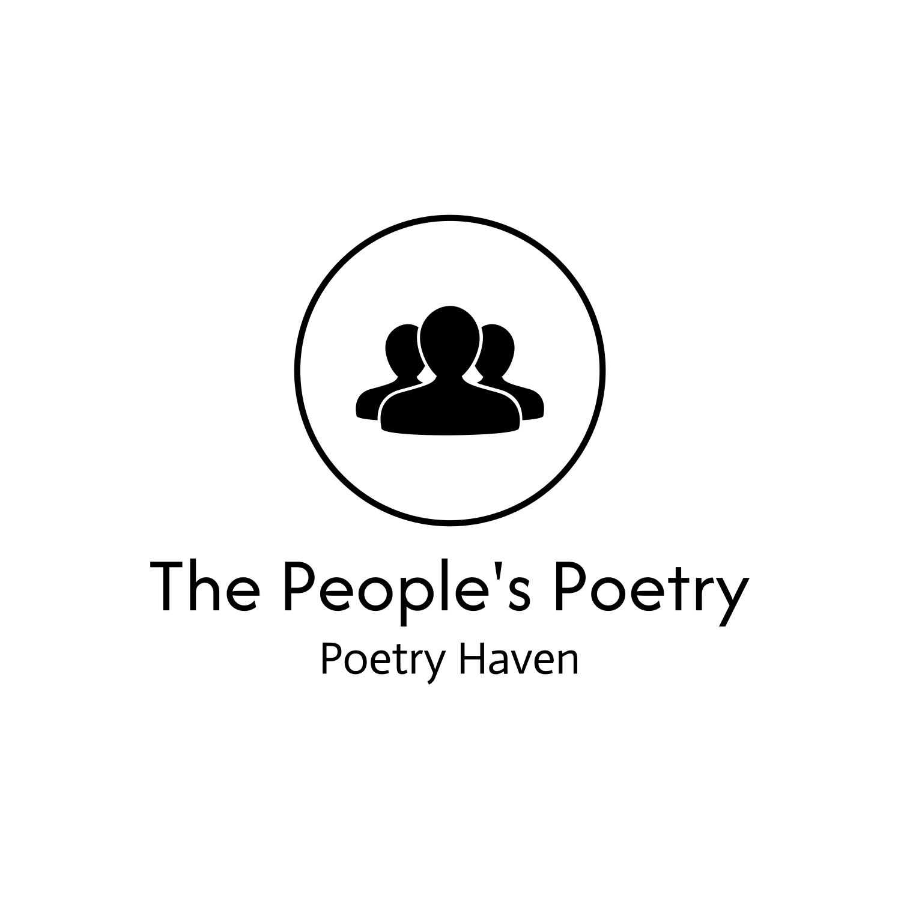

# Poetry Haven Inc. - Home Landing Page
https://poetry-haven-seven.vercel.app/

## Project Overview

Welcome to the Poetry Haven, Inc. home landing page design project. This project is intended to showcase a creative and impactful design for the company's website. The goal is to create a visually appealing and user-friendly landing page that includes the following essential elements:

- **Log In button**
- **Create Account button**
- **Search Poet feature**
- **Subscribe Now button**
- **A self-designed company logo**
-
- 

# Poetry Haven Inc. - Landing Page Design



## Project Structure

- `index.html` - The main HTML file that structures the landing page.
- `styles.css` - The CSS file containing all styling rules for the page.
- `public/logo.png` - The custom-designed company logo used in the header.
- `Header.js` - A React component that includes the logo and search bar.
- `App.js` - The main React component where all elements are assembled.
- `README.md` - This file, providing an overview of the project.

## Design Considerations

- **Theme**: The design embraces the artistic and poetic spirit of Poetry Haven, Inc., using a clean, modern aesthetic.
- **Responsiveness**: The layout is designed to be responsive, ensuring usability across various devices and screen sizes.
- **User Experience**: Navigation is intuitive, with prominent buttons and an easy-to-use search feature.

## How to Run the Project

1. Clone the repository:
   ```bash
   git clone https://github.com/PRINCEMISHRAJI/Poetry-Haven-assignment
